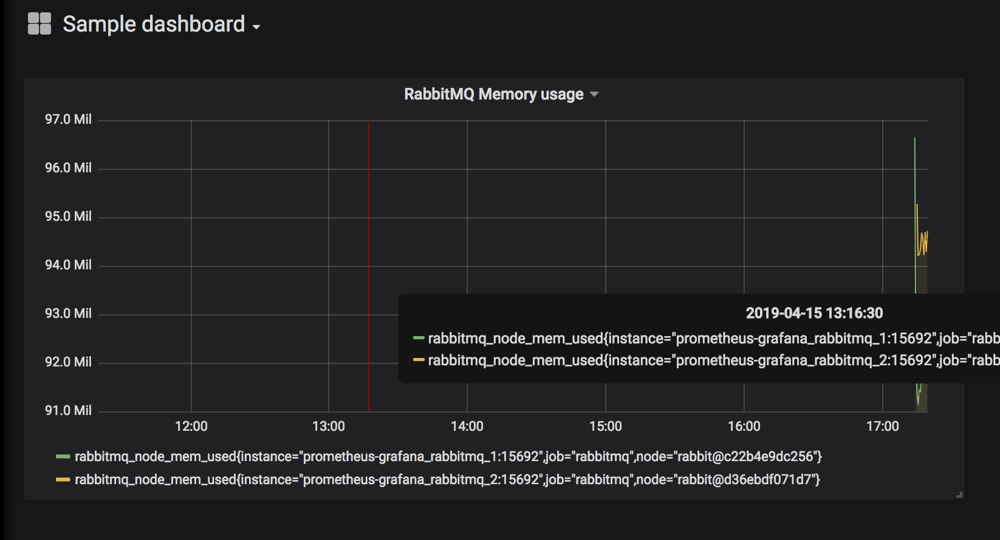

# RabbitMQ monitoring with Prometheus and Grafana


## Get started

Run the following commands to get a single node cluster with Prometheus and Grafana ready to use:
```
cd prometheus-grafana
docker-compose up
```
> The docker-compose uses a RabbitMQ build from 3.8 line that uses the latest [Prometheus plugin exporter](https://github.com/rabbitmq/rabbitmq-prometheus)

Go to [Grafana running at http://localhost:3000](http://localhost:3000) and create a dashboard by importing the provided [sample dashboard](https://github.com/rabbitmq/rabbitmq-prometheus/grafana/RabbitMQ-Overview-1555330869614.json) (for convenience there is a [local](grafana/RabbitMQ-Overview-1555330869614.json) copy of this dashboard).


